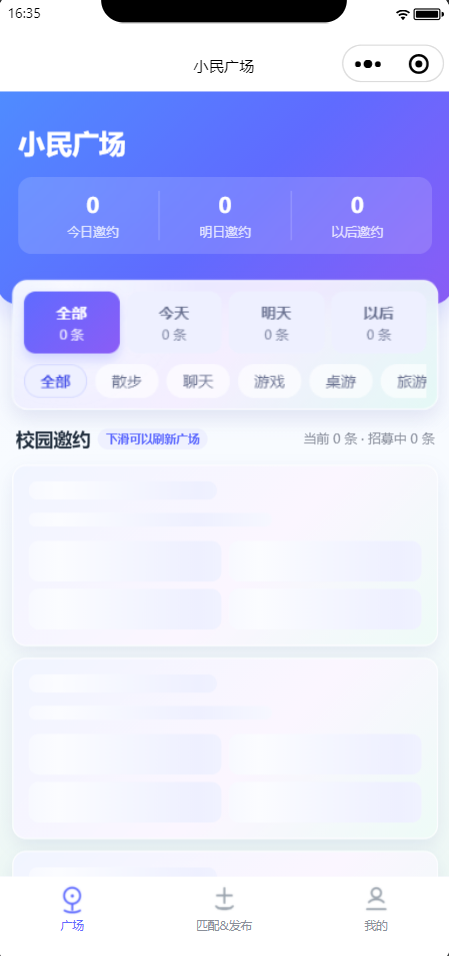
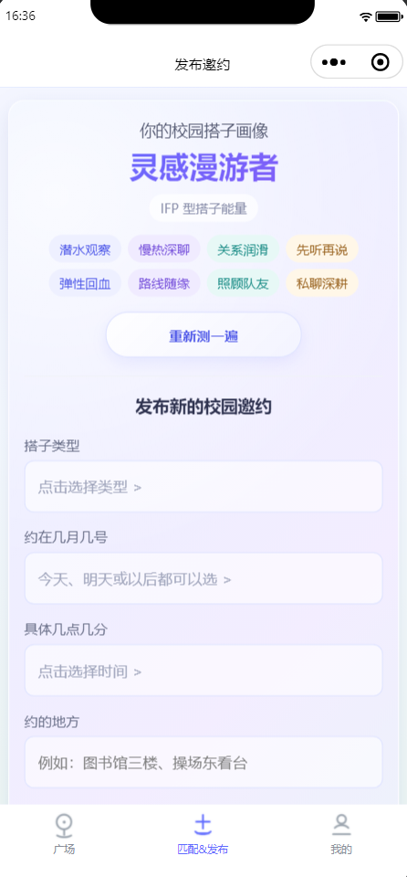
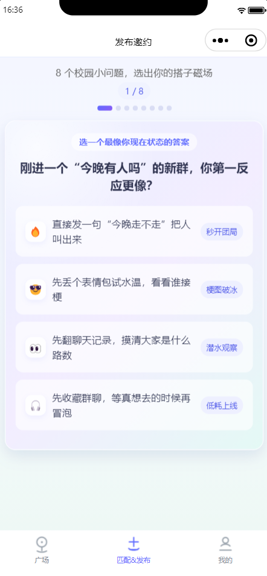
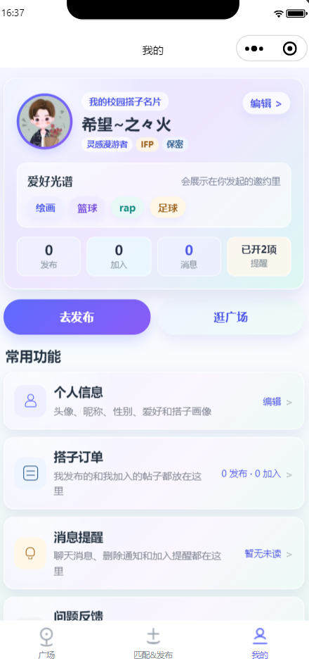
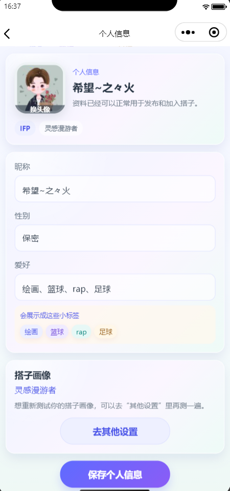
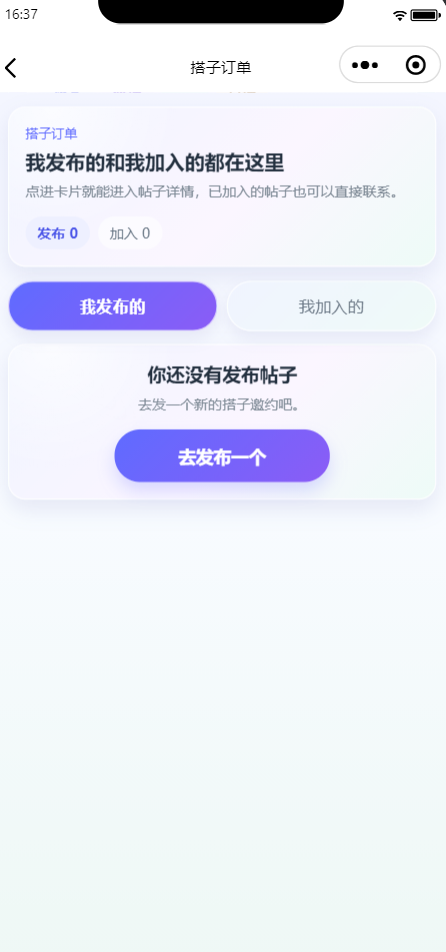
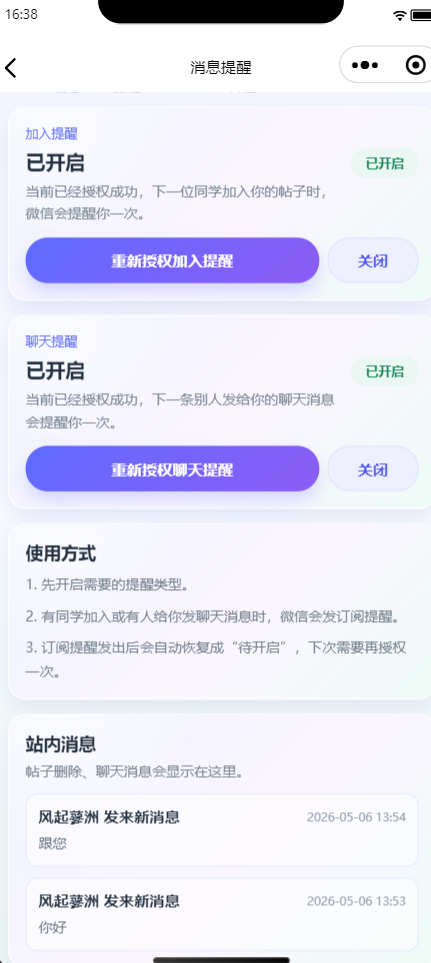

# 小民搭子

面向中央民族大学同学的校园搭子小程序。用户可以完善个人资料，生成搭子画像，发布学习、干饭、运动、游戏、聊天、散步、桌游、旅游、拼单等邀约，也可以在广场加入其他同学发布的搭子，并通过站内聊天和消息提醒完成后续沟通。

## 项目展示

| 广场 | 发布 | 搭子画像测试 |
| --- | --- | --- |
|  |  |  |

| 我的 | 个人信息 | 搭子订单 | 消息提醒 |
| --- | --- | --- | --- |
|  |  |  |  |

## 功能特性

- 搭子广场：按全部、今天、明天、以后筛选，并支持学习、干饭、运动、游戏、聊天等类型分类浏览。
- 发布邀约：填写类型、时间、地点、人数、性别偏好、补充说明和联系电话，支持编辑草稿与发布校验。
- 搭子画像：通过轻量问答生成 MBTI/人设标签，并同步到用户资料和帖子展示。
- 个人资料：维护头像、昵称、性别、爱好标签和搭子画像信息。
- 搭子订单：区分“我发布的”和“我加入的”，可查看详情、拨打联系电话。
- 帖子详情：支持加入、退出、编辑、删除、满员状态展示和权限控制。
- 站内聊天：发起人和已加入用户之间可建立会话，聊天页定时轮询消息。
- 消息提醒：支持加入提醒、聊天提醒、站内通知和未读数展示。
- 隐私保护：联系电话不放入公开帖子，仅发起人和已加入用户可见；年龄信息不收集、不展示。

## 技术栈

- 微信小程序原生框架：WXML、WXSS、JavaScript
- 微信云开发：云函数、云数据库、云存储、OpenID
- 云函数依赖：`wx-server-sdk`
- 小程序基础库：`2.20.1`

## 目录结构

```text
.
├── miniprogram/                    # 小程序前端源码
│   ├── app.js                      # 全局状态、云环境、订阅消息配置
│   ├── app.json                    # 页面路由、分包、tabBar 配置
│   ├── pages/
│   │   ├── index/                  # 搭子广场
│   │   ├── publish/                # 搭子画像测试与发布邀约
│   │   └── mine/                   # 我的页面
│   ├── pkg-extra/
│   │   ├── detail/                 # 帖子详情
│   │   ├── chat/                   # 站内聊天
│   │   └── privacy/                # 隐私说明
│   └── pkg-mine/
│       ├── profile/                # 个人信息
│       ├── orders/                 # 搭子订单
│       ├── notifications/          # 消息提醒
│       ├── feedback/               # 意见反馈
│       └── settings/               # 设置
├── cloudfunctions/
│   └── quickstartFunctions/        # 主云函数
├── 成品展示图/                     # README 展示截图
├── project.config.json             # 微信开发者工具项目配置
└── .gitignore                      # Git 忽略规则，本地私有配置不提交
```

## 云开发设计

### 云数据库集合

- `users`：用户资料、搭子画像、订阅提醒状态。
- `posts`：公开搭子帖子信息，不保存新发布帖子的联系电话。
- `post_contacts`：帖子联系电话，仅通过云函数按权限返回。
- `notifications`：站内消息、删除通知、聊天消息通知。
- `chat_conversations`：聊天会话。
- `chat_messages`：聊天消息。
- `feedbacks`：用户反馈。
- `creator_penalties`：发起人删除已有人加入帖子的限制记录。

### 主云函数

主云函数目录：`cloudfunctions/quickstartFunctions`

已包含能力：

- `getOpenId`
- `getMiniProgramCode`
- `createPost`
- `getPosts`
- `getPostDetail`
- `joinPost`
- `cancelJoinPost`
- `updatePost`
- `deletePost`
- `getMyPosts`
- `submitFeedback`
- `checkNickname`
- `saveJoinNotifyStatus`
- `saveChatNotifyStatus`
- `getNotifications`
- `markNotificationsRead`
- `getOrCreateChat`
- `getChatMessages`
- `sendChatMessage`

## 本地运行

1. 使用微信开发者工具导入项目根目录。
2. 确认 `project.config.json` 中的 `miniprogramRoot` 为 `miniprogram/`，`cloudfunctionRoot` 为 `cloudfunctions/`。
3. 将 `project.config.json` 中的 `appid` 从 `touristappid` 替换为自己的小程序 AppID。
4. 开通并选择微信云开发环境。
5. 将 `miniprogram/app.js` 中的 `CLOUD_ENV` 替换为自己的云环境 ID。
6. 如需使用订阅消息，将 `JOIN_NOTIFY_CONFIG` 和 `CHAT_NOTIFY_CONFIG` 中的模板 ID 替换为自己的模板。
7. 在云开发控制台创建或确认所需数据库集合。
8. 右键 `cloudfunctions/quickstartFunctions`，选择“上传并部署：云端安装依赖”。
9. 重新编译小程序，即可在开发者工具中预览。

## 配置与定制咨询

公开仓库默认不包含真实 AppID、云环境 ID、订阅消息模板 ID 等个人项目配置。需要配置指导，或希望将项目用于软件、计算机设计大赛、挑战杯等重要赛事的展示、参赛打磨和功能定制，可通过 [B 站主页](https://space.bilibili.com/675307549?spm_id_from=333.1007.0.0) 联系咨询。

## 发布前注意

- 如果公开到 GitHub，建议不要提交本地私有配置、真实 AppID、云环境 ID、订阅消息模板 ID 等个人项目配置。
- `project.private.config.json` 通常只用于本地开发，可按需加入 `.gitignore`。
- 修改云函数后，需要在微信开发者工具中重新上传并部署 `quickstartFunctions`。
- 使用隐私接口、头像昵称、联系电话、订阅消息等能力前，请确认微信公众平台后台的用户隐私保护指引已配置。

## 当前业务规则

- 用户资料包含微信头像、微信昵称、性别、爱好、MBTI/人设标签。
- 年龄信息不收集、不展示。
- 联系电话发布时填写，但不进入公开帖子；只有发起人和已上车用户可见。
- 帖子满员后标记为“已满员”，不自动删除。
- 我的页面展示“我发布的”和“我加入的”搭子。
